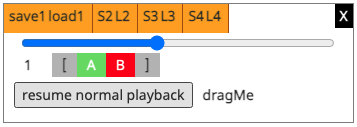

# Loopy

Loopy is a JavaScript snippet/bookmarklet that creates an A-B Loop widget in whatever web page you happen to be currently browsing.

It allows you to loop a section of content playing in an audio or video element and also adjust its playback rate.

Loopy is useful for practicing music.



## Controls
**A** set the begin loop point
**B** set the end loop point
**[**  nudge `A` backward 1 second
**]**  nudge `B` forward 1 second

The slider controls the playback rate.

The `dragMe` label allows you to drag the widget around your web page.

## Making your own changes

Paste loopy-snippet.js into Chrome > Developer Tools > Sources > Snippets > + New Snippet

Make your changes to the source code in the browser or in `loopy-snippet.js` itself

**Important notes**
- Edit `loopy-snippet.js` only, **not** `loopy-bookmarklet.js`
- Only use one-line `//`-style comments `on their own line`

`Save As...` loopy-snippet.js

## Generate a bookmarklet from your changes

```
./create-bookmarklet-from-snippet.sh
```
In your browser, create a new bookmark and paste the contents of loopy-bookmarklet.js into the URL field.


# References

Dragging
https://www.w3schools.com/howto/howto_js_draggable.asp